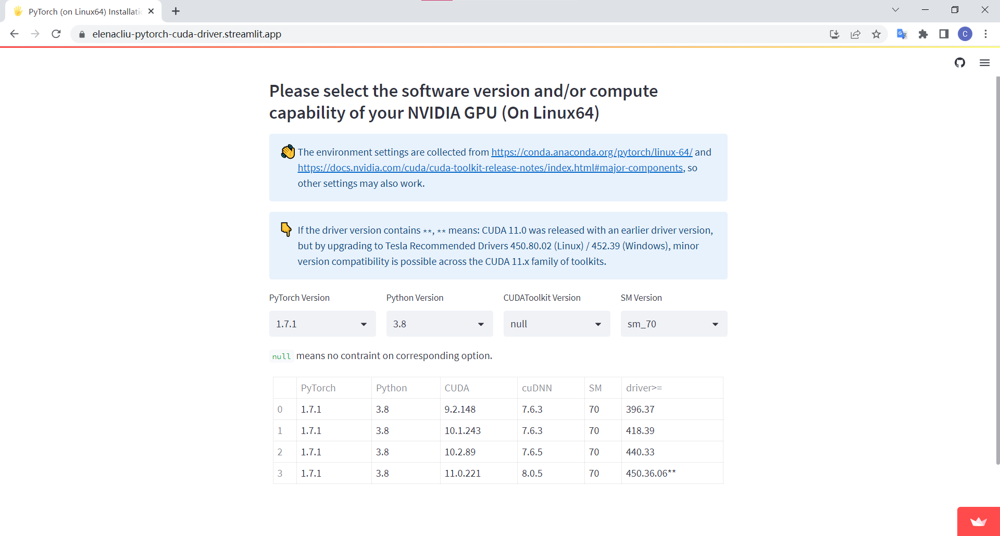

# PyTorch (on Linux64) Installation Environment Selection

The project is a utility tool for PyTorch installation on Linux64 machine.

## Compute Capabilities of each PyTorch Package
`pytorch_compute_capabilities.py` checks the compute capabalities of each pytorch package in the [PyTorch conda channel](https://anaconda.org/pytorch) by running `cuobjdump` from the [CUDA Toolkit](https://docs.nvidia.com/cuda/) on the included `*.so` files.

For results see [table.csv](table.csv).

## Start Web Service for Environment Selection

Run `streamlit run app.py` in your terminal, or you can visit [this web page](https://elenacliu-pytorch-cuda-driver.streamlit.app/).

### Usage

Just select the PyTorch (or Python or CUDA) version or compute capability you have, the page will give you the available combinations. 

For example, if you want to install PyTorch v1.7.1 through conda, Python of your conda environment is v3.8 and the GPU you use is Tesla V100, then you can choose the following option to see the environment constraints.

If there is no output, that means your needs *possibly* cannot be satisfied.

If you cannot find older cuDNN version from conda channels (such as `-c nvidia`, `-c conda-forge`, `-c anaconda`, `-c main`), you can find archive packages [here](https://developer.nvidia.com/rdp/cudnn-archive).

# Acknowledgement

This repo is inherited from [https://github.com/moi90/pytorch_compute_capabilities](https://github.com/moi90/pytorch_compute_capabilities) of [Simon-Martin Schröder](https://github.com/moi90). I reuse the code `pytorch_compute_capabilities.py` to collect version constraints.

# References

Here are some great resources that provide insight into compatibility of cuda:

[https://docs.nvidia.com/cuda/cuda-toolkit-release-notes/index.html#major-components](https://docs.nvidia.com/cuda/cuda-toolkit-release-notes/index.html#major-components)

[https://jia.je/software/2021/12/26/nvidia-cuda/](https://jia.je/software/2021/12/26/nvidia-cuda/)

[https://jia.je/software/2022/07/06/install-nvidia-cuda/](https://jia.je/software/2022/07/06/install-nvidia-cuda/)

[https://arnon.dk/matching-sm-architectures-arch-and-gencode-for-various-nvidia-cards/](https://arnon.dk/matching-sm-architectures-arch-and-gencode-for-various-nvidia-cards/)

[https://github.com/moi90/pytorch_compute_capabilities](https://github.com/moi90/pytorch_compute_capabilities)
